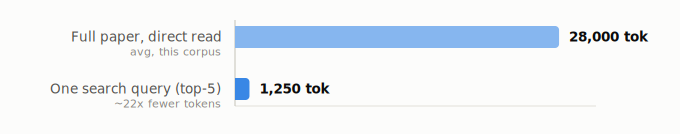
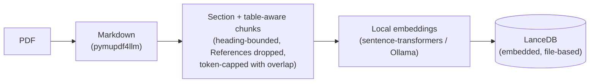
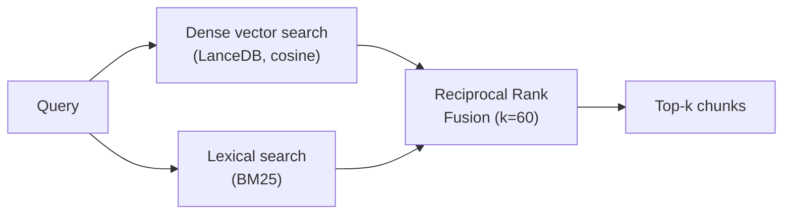
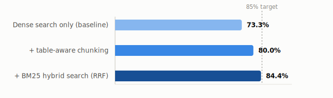
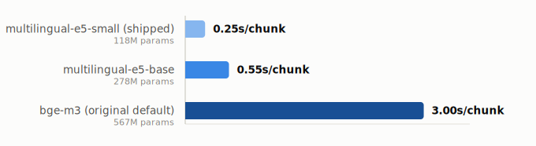

# paper-rag

Local, embedded RAG over a folder of PDFs, built for Claude Code research
repos: retrieve the relevant chunks of a paper instead of re-reading whole
PDFs on every synthesis turn, and pull in new open-access papers without ad
hoc scraping. Everything — embeddings, vector store, lexical index — runs
on-machine; no PDF content or query ever leaves your computer.

<picture>
  <source media="(prefers-color-scheme: dark)" srcset="assets/tokens-dark.svg">
  
</picture>

- **Local-only embeddings** — `sentence-transformers` (default:
  `intfloat/multilingual-e5-small`) or Ollama. No hosted embedding API is
  ever called.
- **Hybrid retrieval** — dense vector search (LanceDB) *and* lexical BM25,
  merged by Reciprocal Rank Fusion, so exact table values and acronyms are
  found alongside conceptual matches. See [How it works](#how-it-works).
- **Embedded vector store** — [LanceDB](https://lancedb.github.io/lancedb/),
  file-based, no server process. Treated as a disposable build artifact,
  never committed — see [Why the index isn't portable](#why-the-index-isnt-portable).
- **Open-access acquisition** — chains Semantic Scholar -> OpenAlex ->
  Unpaywall-by-DOI, stops at the first legally open PDF.
- **Claude Code native** — an MCP server (`search_papers`,
  `list_indexed_papers`) plus a CLI, both installed by one `paper-rag init`
  run per project.

## Install

Requires Python >= 3.10 and [pipx](https://pipx.pypa.io/) (isolates
`paper-rag`'s dependencies from whatever else is on your system — installs
it via `pip install --user pipx` if you don't have it already):

```bash
pipx install "paper-rag @ git+https://github.com/LucasJLBraz/paper-rag.git"
```

Verify it landed and is on `PATH`:

```bash
paper-rag --version
```

If that fails with "command not found," run `pipx ensurepath` and open a
new terminal — pipx installs binaries into a directory it manages, which
needs to be on `PATH` for the shell that will launch Claude Code, not just
the one you ran `pipx install` from.

**For development** instead: `pip install -e ".[dev]"` from a local clone.
The trade-off is that `paper-rag` / `paper-rag-mcp` then only resolve
inside that virtualenv — make sure it's active in whatever shell/session
launches Claude Code, or the MCP server registration below will silently
fail to start. `paper-rag init` checks this for you and warns if it
detects a problem.

## Quickstart

```bash
cd your-research-repo
paper-rag init                 # writes .paper-rag.toml, .mcp.json, .claude/skills/paper-rag/, .gitignore
# edit .paper-rag.toml: set acquire.contact_email and corpus.papers_dir
paper-rag build                 # ingest every PDF under papers_dir
paper-rag search "your query"   # sanity-check retrieval from the shell
```

`init` is safe to re-run any time — it only ever *writes* `.paper-rag.toml`
if one doesn't exist yet, but always refreshes the bundled skill file and
the `paper-rag` entry in `.mcp.json` to the currently-installed version, and
adds the configured index directory to `.gitignore` (a disposable build
artifact — see [Why the index isn't portable](#why-the-index-isnt-portable) —
that should never end up in a commit).

Inside Claude Code, `.mcp.json` registers the `paper-rag` MCP server so
`search_papers` / `list_indexed_papers` are called as native tools — no
shelling out needed. **Restart Claude Code (or reconnect MCP servers)
after running `init`** so it picks up the newly-registered server; it won't
appear in an already-running session. The bundled Claude Code skill
(copied into `.claude/skills/paper-rag/` by `init`) documents when to use
retrieval vs. a full PDF read vs. acquisition.

### Troubleshooting

- **`search_papers` / `list_indexed_papers` don't show up in Claude Code**:
  most likely `paper-rag-mcp` isn't resolvable on `PATH` from the process
  that launches Claude Code — `paper-rag init` prints a warning at setup
  time if it detects this; see the pipx/venv notes under Install above.
  Otherwise, restart the Claude Code session (or reconnect MCP servers) —
  it only reads `.mcp.json` at startup.
- **`search` / `search_papers` returns nothing**: the index probably
  hasn't been built yet, or was built for a different corpus — run
  `paper-rag build`.
- **First `build` looks stuck**: it isn't — CPU embedding is the slow
  part by design (see [Performance](#performance)), and the process prints
  progress per paper as it goes. Give it the couple of minutes the table
  below suggests before assuming it's hung.

## How it works

**Ingestion** (`paper-rag build`) turns each PDF into embedded, searchable
chunks:



Tables get special handling: a markdown table is split into small row
batches with its caption and header repeated in every batch (instead of
becoming one indivisible, unsearchable blob), and cells that visually span
several rows are filled forward so a data row never loses the group label
that identifies it. This was the single biggest retrieval-quality fix found
during development — see [HANDOFF.md](HANDOFF.md) for the investigation.

`paper-rag build` is incremental — it hashes each PDF and skips ones it's
already indexed (tracked in `<index_dir>/manifest.json`). Use `--rebuild`
to force full re-ingestion, e.g. after switching embedding models. Every
`build` (including `--rebuild`) also prunes citation_keys that no longer
have a PDF in `papers_dir` — from both the LanceDB table and the manifest —
so deleting a paper doesn't leave stale, unsearchable chunks behind.

**Retrieval** (`paper-rag search` / the MCP `search_papers` tool) queries
two independent indexes and merges the rankings, rather than trusting
either alone:



Dense embeddings are good at conceptual matches ("how does the model
handle missing values?") but can blur together near-duplicate content —
the same metric reported in three different tables, say. BM25 catches
exact tokens (model names, acronyms, numbers) that a dense embedding has
no reason to weight highly. Neither index needs to "win": Reciprocal Rank
Fusion combines their two rankings without requiring cosine distance and
BM25 score to be on a comparable scale in the first place.

## Performance

Measured on the project's own dev corpus (7 papers, 625 chunks, Intel
i5-1135G7 laptop CPU, no GPU) — real numbers from this corpus, not
estimates. Full investigation, including three reranker models that were
tried and reverted, in [HANDOFF.md](HANDOFF.md).

**Retrieval quality.** Hit Rate@5 on a 45-question benchmark (specific
table values, hyperparameters, named methods — deliberately harder than
typical conceptual questions) against 3 held-out papers:

<picture>
  <source media="(prefers-color-scheme: dark)" srcset="assets/hit-rate-dark.svg">
  
</picture>

| stage | Hit Rate@5 |
|---|---|
| Dense search only (baseline) | 73.3% |
| + table-aware chunking | 80.0% |
| + BM25 hybrid search (RRF) | **84.4%** |

The remaining gap to 85% isn't a retrieval-breadth problem — widening the
candidate pool doesn't move it. What's left is a handful of questions where
a paper reports the same numbers across three near-duplicate tables, which
needs passage-level disambiguation, not better ranking. See HANDOFF.md for
the full miss analysis. Ordinary conceptual questions ("how does X work,"
"what baselines does this use") retrieve more reliably than this
adversarial benchmark suggests in isolation.

**Embedding speed.** CPU throughput was the deciding factor in the default
model — this machine has no CUDA GPU, so a full corpus rebuild has to be
tolerable on CPU alone:

<picture>
  <source media="(prefers-color-scheme: dark)" srcset="assets/speed-dark.svg">
  
</picture>

`multilingual-e5-small` was chosen over an English-only model specifically
because queries against a mixed-language corpus need cross-lingual
query→passage matching — an English-only model can't do that, silently
breaking non-English queries against English papers.

**Token usage, vs. Claude reading the full paper directly** — see the chart
at the top of this README: **~22x fewer tokens** per targeted query (~1,250
vs. ~28,000 for a full paper). Even a research session running ~10 targeted
queries against one paper — a realistic upper bound for pulling out several
specific facts — costs ~12,500 tokens: still well under a single full read,
and each query returns exactly the relevant passage instead of requiring
Claude to re-scan the whole paper's context on every turn.

**Latency:**

| operation | cost |
|---|---|
| `paper-rag build` (embedding) | ~0.2-0.3s/chunk — a 625-chunk/7-paper corpus rebuilds cold in ~2 min |
| `paper-rag search` (CLI, cold process) | ~10-13s, almost entirely one-time model load |
| `search_papers` via the MCP server (warm — the primary integration) | ~20ms/query after the one-time server-startup load |

The CLI pays the embedding model's load cost on every invocation since
each run is a fresh process; the MCP server (registered by `paper-rag
init`, the intended way to use this from Claude Code) loads it once at
startup and stays warm for the session, so query latency there is
effectively just the hybrid search itself.

## Why the index isn't portable

The vector index is deliberately **not** meant to be copied between
machines or committed to git. It's a deterministic, disposable build
artifact of the PDFs + config — regenerating it locally (`paper-rag build`)
is fast and avoids the two real failure modes of shipping a vector store as
a file: binary-blob git bloat, and silent staleness if it was built with a
different embedding model than the one currently configured (`PaperIndex`
refuses to open a mismatched index rather than returning garbage results —
see `ingest/index.py`).

What *is* portable, and what actually matters: the PDFs and their
companion `.md` metadata files, and this package itself.

## Configuration (`.paper-rag.toml`)

```toml
[corpus]
papers_dir = "references/Papers"

[index]
dir = ".rag_index"
table_name = "chunks"

[embedding]
backend = "sentence-transformers"   # or "ollama"
model = "intfloat/multilingual-e5-small"
ollama_host = "http://localhost:11434"

[chunking]
max_tokens = 400
overlap_tokens = 60

[acquire]
contact_email = "you@example.com"   # required by Unpaywall
semantic_scholar_api_key = ""       # optional, raises rate limit
```

`paper-rag` looks for `.paper-rag.toml` by walking up from the current
directory, so it works from any subdirectory of the repo.

## Companion metadata files

Every acquired/ingested paper is expected to have a `<citation_key>.md`
sitting next to its PDF with frontmatter:

```yaml
---
citation_key: kim2025epic
doi: 10.xxxx/yyyy
title: "..."
authors:
  - Jinhee Kim
published: 2025
source: semantic_scholar
source_url: https://...
pdf: references/Papers/kim2025epic.pdf
---

## Abstract

...
```

`paper-rag acquire` writes this automatically. If you're pulling in arXiv
papers, use a dedicated arXiv-fetch tool for those instead (this schema is
compatible with one) — `paper-rag acquire` is for everything Semantic
Scholar / OpenAlex / Unpaywall can resolve that arXiv-specific tooling
can't.

## Development

```bash
pip install -e ".[dev]"
pytest
```

## License

MIT
